# AI-Driven Autism Detection System

## Overview
This project is an advanced computer vision and machine learning system for early detection of autism spectrum disorder (ASD) in toddlers and children. It combines questionnaire-based screening with real-time and offline behavioral pattern analysis using video and image data.

## App Screenshots

### Main App Interface Dashboard
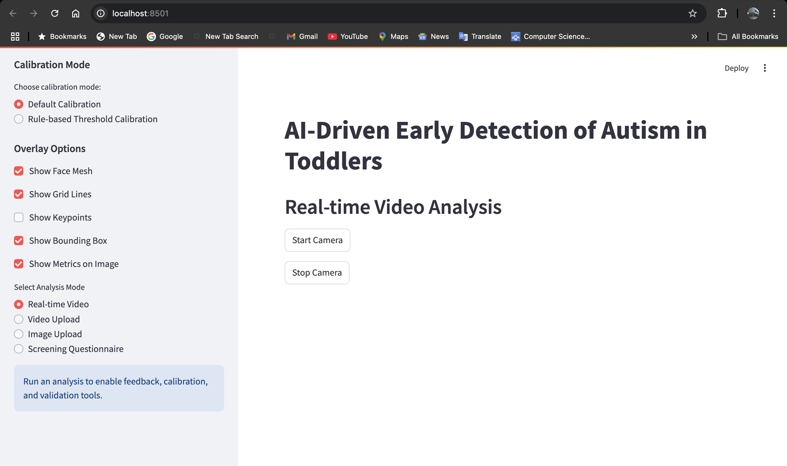

### Real-time Video Analysis
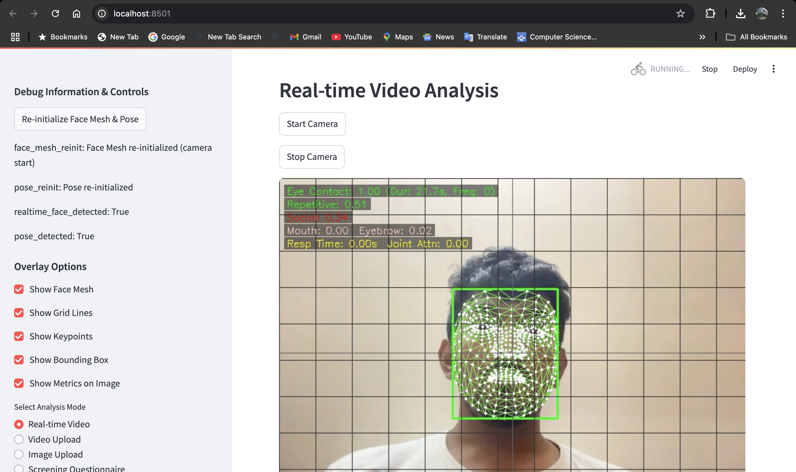
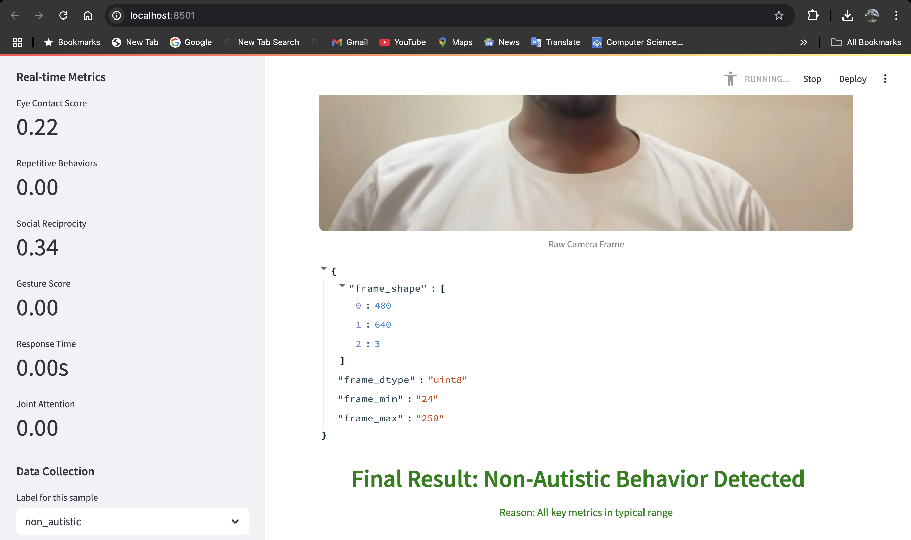

### Image Upload Analysis (with Rule-based Threshold Calibration & Model Validation)
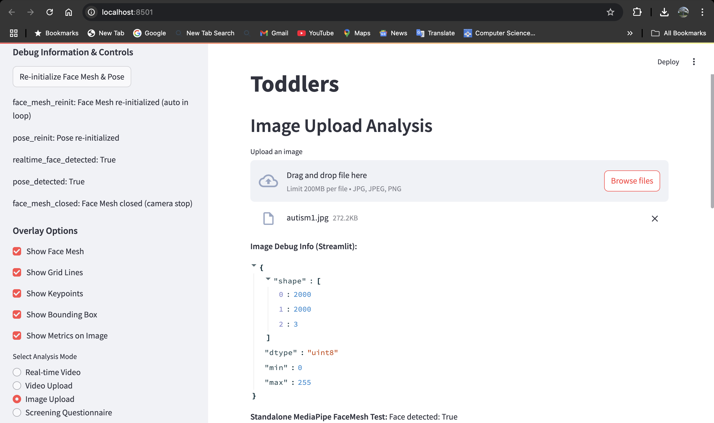
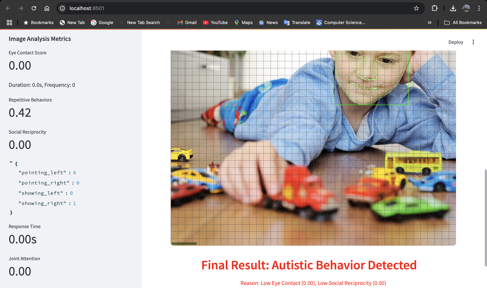
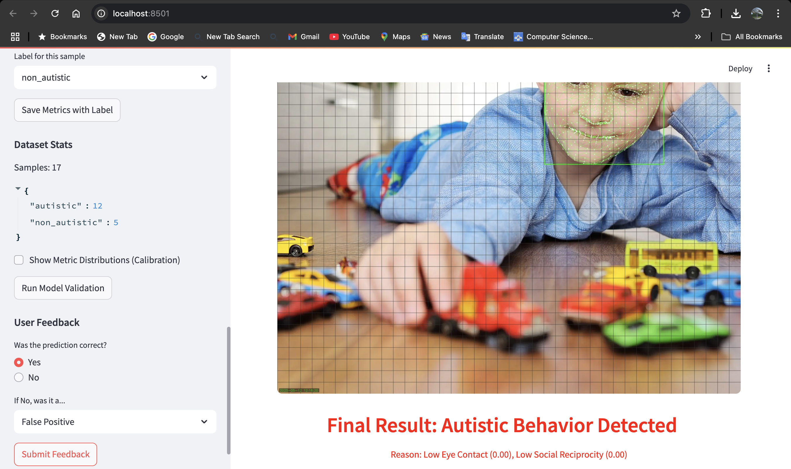
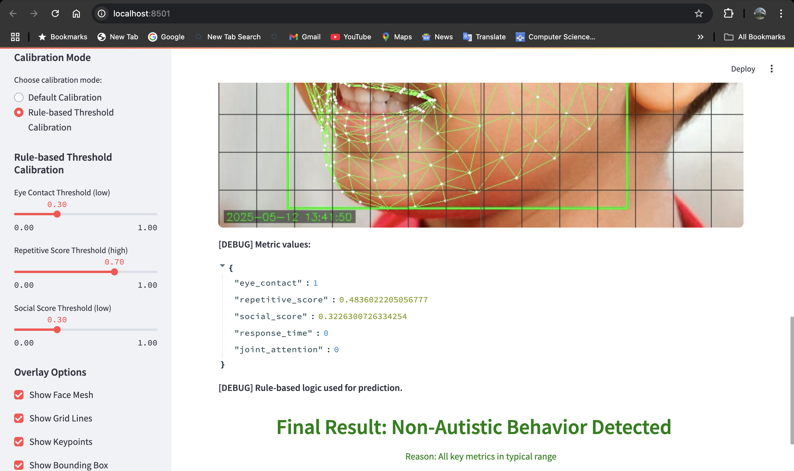
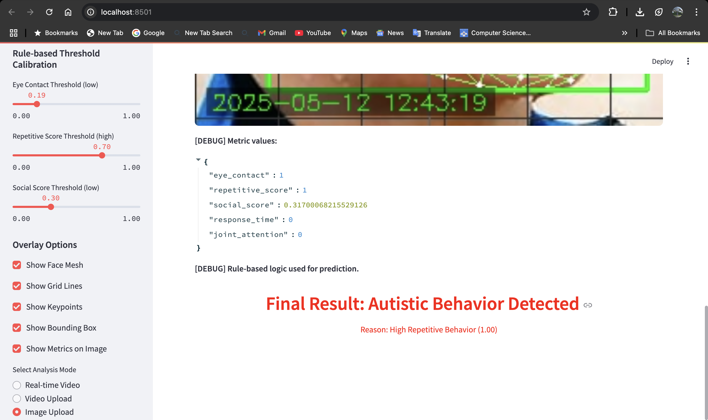
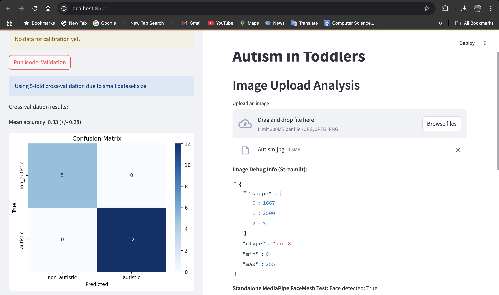
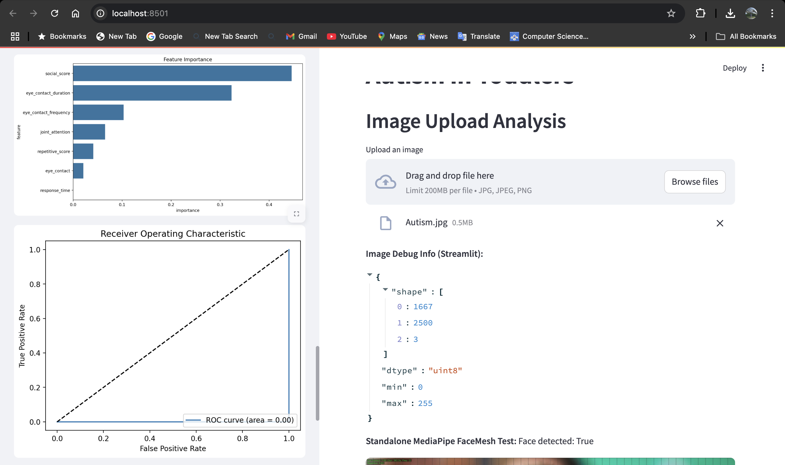

### Video Upload Analysis
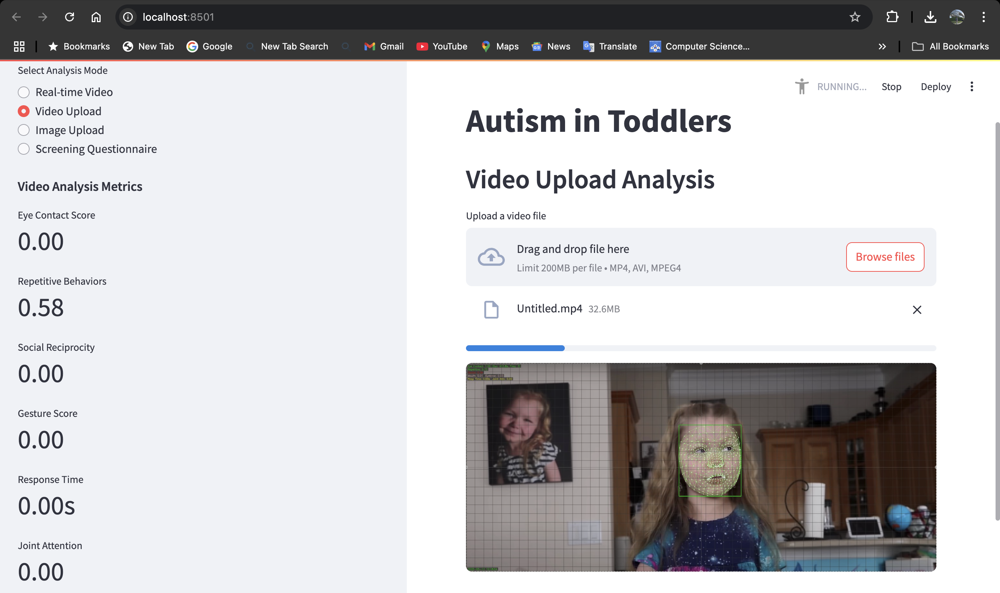

### Autism Screening Questionnaire Analysis
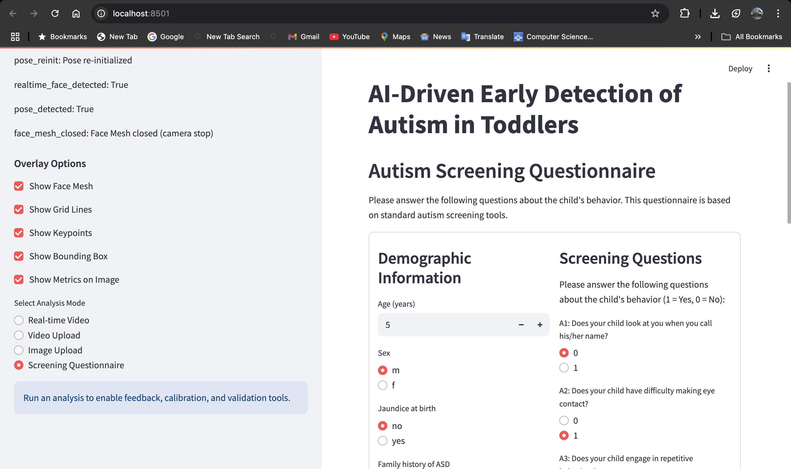
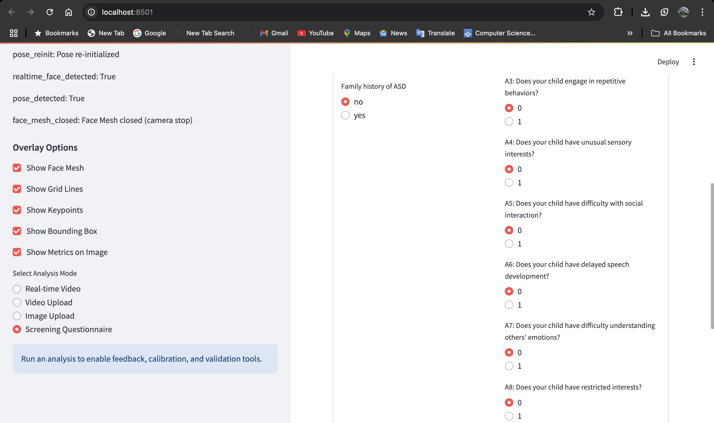
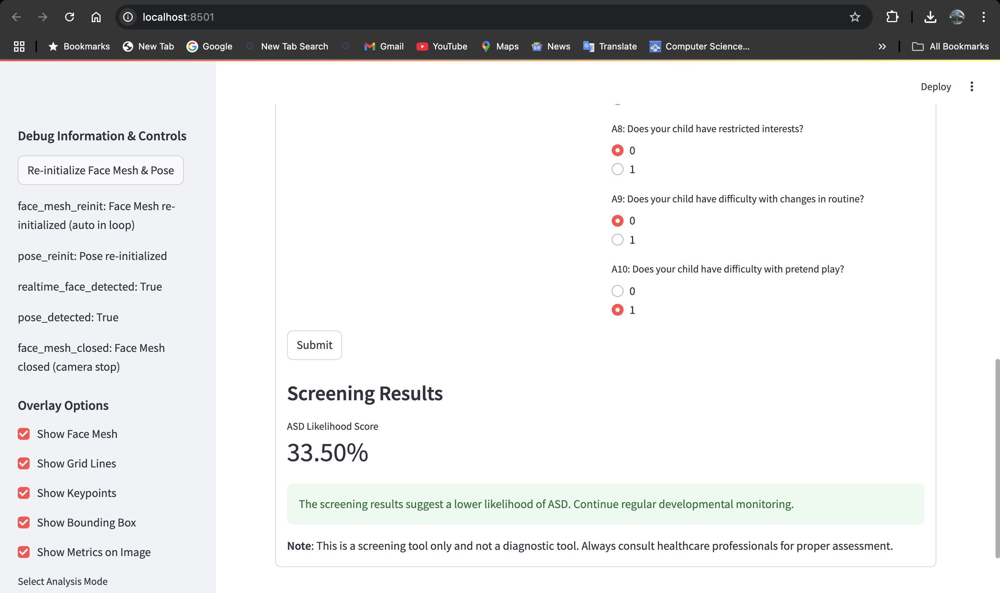
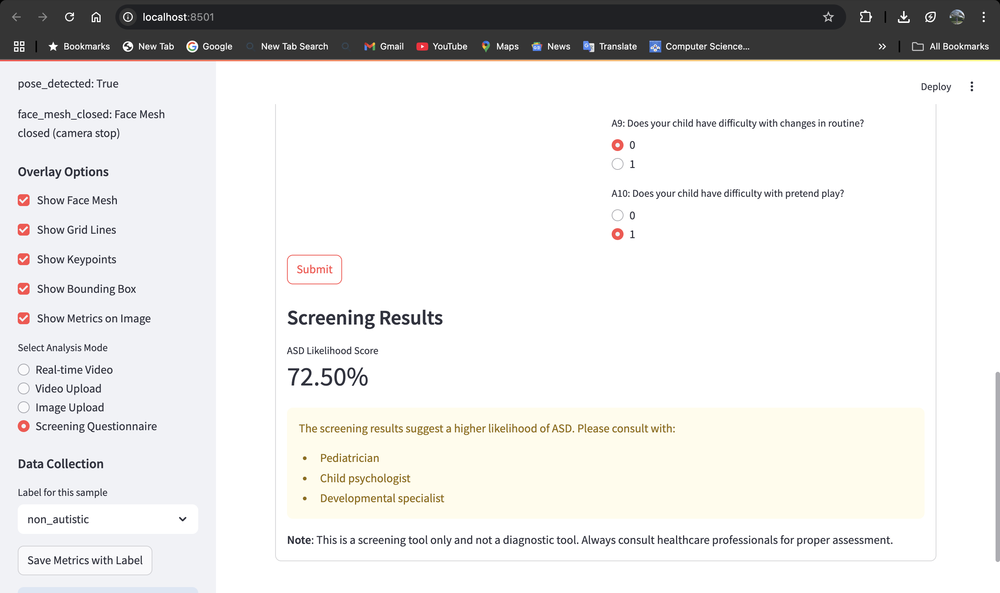

## Features
- **Three Analysis Modes:**
  - Real-time Video (webcam)
  - Video Upload
  - Image Upload
- **Robust MediaPipe FaceMesh Initialization:**
  - Each mode uses a fresh, mode-specific FaceMesh object for reliable detection.
  - Automatic re-initialization and error handling.
- **Detailed Behavioral Metrics:**
  - Eye Contact Score (with frequency and duration)
  - Repetitive Behavior Score
  - Social Reciprocity Score (with mouth, eyebrow, and head orientation details)
  - Gesture Recognition (pointing, showing, etc.)
  - Response Time Analysis
  - Joint Attention Tracking
- **Customizable Visualization:**
  - Toggle overlays: Face Mesh, Grid Lines, Keypoints, Bounding Box, Metrics
  - Large, responsive image/video display
  - Compact, color-coded metric overlay (tiny font, semi-transparent background)
  - All detailed metrics in the sidebar
- **Robust Error Handling:**
  - Automatic re-initialization of models
  - Debug sidebar for troubleshooting

## Quick Start
1. **Install dependencies:**
   ```bash
   pip install -r requirements.txt
   ```
2. **Run the app:**
   ```bash
   OPENCV_AVFOUNDATION_SKIP_AUTH=1 streamlit run src/streamlit_app.py
   ```
3. **Use the sidebar to select mode and customize overlays.**

## Usage
- **Real-time Video:**
  - Click "Start Camera" to begin analysis.
  - FaceMesh is re-initialized on each start for reliability.
- **Video Upload:**
  - Upload a video file (mp4/avi). Each video uses a fresh FaceMesh object.
- **Image Upload:**
  - Upload a photo. Each image uses a fresh FaceMesh object with static image mode.
- **Overlay Options:**
  - Toggle Face Mesh, Grid Lines, Keypoints, Bounding Box, and Metrics on the image.
- **Metrics:**
  - Key metrics are shown on the image with a tiny font and color coding.
  - All details (including frequency, duration, gesture breakdown, etc.) are in the sidebar.

## Example Metrics
- **Eye Contact:** 0.85 (Duration: 6.2s, Freq: 3)
- **Repetitive Score:** 0.12
- **Social Score:** 0.67 (Mouth: 0.12, Eyebrow: 0.08)
- **Gestures:** Pointing Right: 1.00
- **Response Time:** 0.45s
- **Joint Attention:** 0.90

## Project Structure
- `src/streamlit_app.py` — Main Streamlit application
- `models/` — Saved models
- `data/` — Raw and processed datasets
- `docs/` — Documentation (model, dataset, API)

## Troubleshooting
- Use the debug sidebar for real-time feedback on model initialization and face detection.
- If face detection fails, try toggling overlays or re-initializing the camera/model.
- For best results, use well-lit, front-facing images/videos.

## Contributing
See `CONTRIBUTING.md` for guidelines.

## License
MIT

## Contact
For questions or support, open an issue or contact the maintainer.

## Technical Implementation

### Analysis Methods

1. **Eye Contact Analysis**
```python
def enhance_eye_contact_analysis(frame, face_mesh_results):
    # Uses MediaPipe Face Mesh for eye landmark detection
    # Calculates Eye Aspect Ratio (EAR)
    # Tracks duration and frequency of eye contact
```

2. **Repetitive Behavior Detection**
```python
def enhance_repetitive_behavior_analysis(frame):
    # Uses motion detection and frame differencing
    # Implements autocorrelation for pattern detection
    # Tracks motion history and periodicity
```

3. **Social Reciprocity Assessment**
```python
def enhance_social_reciprocity_analysis(frame, face_mesh_results):
    # Analyzes facial expressions
    # Tracks head orientation
    # Calculates social engagement score
```

4. **Gesture Recognition**
```python
def analyze_gestures(frame, pose_results):
    # Uses MediaPipe Pose for hand tracking
    # Detects pointing and showing gestures
    # Monitors hand-to-face interactions
```

5. **Response Time Analysis**
```python
def analyze_response_time(frame, current_time):
    # Tracks response to visual stimuli
    # Measures response latency
    # Maintains response time history
```

6. **Joint Attention Tracking**
```python
def analyze_joint_attention(frame, face_mesh_results, pose_results):
    # Monitors gaze direction
    # Tracks attention to objects/hands
    # Detects sustained attention
```

## Getting Started

### Prerequisites
- Python 3.8 or higher
- Webcam or video input device
- Required Python packages (see requirements.txt)

### Installation

1. Clone the repository:
```bash
git clone https://github.com/yourusername/autism-detection.git
cd autism-detection
```

2. Create and activate virtual environment:
```bash
python -m venv venv
source venv/bin/activate  # On Windows: venv\Scripts\activate
```

3. Install dependencies:
```bash
pip install -r requirements.txt
```

4. Run the application:
```bash
# On macOS, use this command to enable camera access:
OPENCV_AVFOUNDATION_SKIP_AUTH=1 streamlit run src/streamlit_app.py

# On other platforms:
streamlit run src/streamlit_app.py
```

### Usage

1. **Real-time Video Analysis**
   - Click "Start Camera" to begin real-time analysis
   - The system will analyze:
     - Eye contact patterns
     - Repetitive behaviors
     - Social reciprocity
     - Gestures
     - Response times
     - Joint attention

2. **Video Upload**
   - Upload MP4 or AVI files
   - System processes video frame-by-frame
   - Progress bar shows analysis status
   - Results update in real-time

3. **Image Upload**
   - Upload JPG, JPEG, or PNG files
   - Single-frame analysis
   - Complete behavioral metrics

4. **Screening Questionnaire**
   - Fill out demographic information
   - Answer screening questions
   - Get machine learning-based assessment
   - View detailed interpretation

## Project Structure

```
autism-detection/
├── data/
│   ├── raw/
│   │   ├── screening/
│   │   │   └── Autism_Screening_Data_Combined.csv
│   │   └── autism_image/
│   │       └── AutismDataset/
│   └── processed/
├── models/
│   └── screening_model.joblib
├── src/
│   ├── streamlit_app.py
│   └── requirements.txt
└── docs/
    ├── README.md
    ├── MODEL_DOCUMENTATION.md
    └── DATASET_DOCUMENTATION.md
```

## Technical Details

### Models Used
1. **MediaPipe Models**
   - Face Mesh for facial landmark detection
   - Pose for body and hand tracking

2. **Machine Learning Models**
   - Random Forest Classifier for screening
   - Custom algorithms for behavioral analysis

### Analysis Metrics
- All metrics are normalized to 0-1 range
- Higher scores indicate:
  - More frequent eye contact
  - More repetitive behaviors
  - Better social reciprocity
  - More gesture use
  - Faster response times
  - Better joint attention

### Performance Considerations
- Real-time processing at 30 FPS
- Efficient resource management
- Automatic cleanup of resources
- Progress tracking for video analysis

## Limitations

1. **Technical Limitations**
   - Requires good lighting conditions
   - Camera access needed for real-time analysis
   - Processing large videos may be slow
   - May be affected by video quality

2. **Clinical Limitations**
   - Not a diagnostic tool
   - Should be used alongside professional assessment
   - Results should be interpreted by healthcare professionals

## Contributing

1. Fork the repository
2. Create a feature branch
3. Commit your changes
4. Push to the branch
5. Create a Pull Request

## License

This project is licensed under the MIT License - see the LICENSE file for details.

## Acknowledgments

- MediaPipe for computer vision models
- Kaggle for datasets
- Streamlit for the web interface

## Contact

For questions or support, please:
- Open an issue on GitHub
- Contact the development team
- Refer to the documentation

## References

1. Autism Screening Dataset: [Kaggle Dataset](https://www.kaggle.com/fabdelja/autism-screening)
2. Autism Image Dataset: [Kaggle Dataset](https://www.kaggle.com/cihan063/autism-image-data)
3. MediaPipe Documentation: [MediaPipe](https://mediapipe.dev/)
4. Streamlit Documentation: [Streamlit](https://docs.streamlit.io/)

## Calibration Mode

The app now supports two calibration modes for rule-based decision logic:

- **Default Calibration:** Uses fixed thresholds for key metrics (eye contact, repetitive behavior, social reciprocity).
- **Rule-based Threshold Calibration:** Lets you adjust thresholds for these metrics using sliders in the sidebar.

You can select the calibration mode in the sidebar. When using Rule-based Threshold Calibration, the thresholds you set will determine when the app flags "Autistic Behavior Detected" (if any one metric is in the red flag range).

## Debug Output

- The app displays the actual metric values for each sample.
- It also shows whether the ML model or rule-based logic was used for the prediction.

## Rule-Based Logic (Updated)

- The rule-based logic is now more sensitive: it flags "Autistic Behavior Detected" if any one of the key metrics is in the red flag range (thresholds are user-adjustable in the sidebar).

## How to Use Calibration

1. Go to the sidebar and select your calibration mode.
2. If you choose Rule-based Threshold Calibration, adjust the sliders for each metric as desired.
3. The app will use your chosen thresholds for all rule-based predictions.

## Model Validation and Metrics (Updated)

- All validation metrics (confusion matrix, ROC curve, accuracy, etc.) are now computed only on the test set, not the full dataset.
- Feature importance is shown for the full model, but all performance metrics and plots use only the test set.
- The code always uses stratified splitting (stratify=y) for train/test split to ensure class balance.
- If stratified splitting fails or if class imbalance is detected in the train or test set, user-friendly warnings are shown and validation is skipped until more balanced data is collected. 